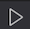

#### Disclaimer: The following is intended for educational purposes only. Not meant for production.

# Exploring the Okta Data Model

This repo contains everything you need to complete the labs in this module:

- Lab 4.1: Get an API token and Set Up the Postman Environment
- Lab 4.2: Create an Okta User via the Users API
- Lab 4.3: Modify an Okta User via the Users API

## How to Start the Labs

These labs are guided by a VSCode plugin called CodeTour. To start Lab 4.1, first expand the **CODETOUR** tab on the lefthand side of VSCode. Then press the  button next to Lab 4.1.

Follow the tour steps until you reach the Checkpoint, proceeding to the next lab only when instructed.
